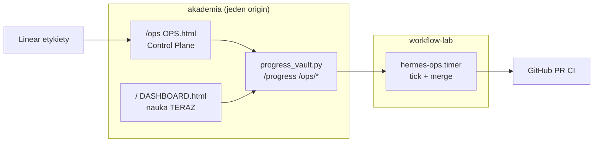

# Plan aktualizacji dokumentacji — Akademia + Hermes Ops (2026-09-24)

**Repo:** `akademia`  
**Autor:** sztab R1 (Cursor)  
**Status:** **WYKONANE** (Fale 0–4 + guard walidatora)  
**Ostatnia weryfikacja:** pełna linia `testy:` z `AGENTS.md`

---

## 1. Cel i werdykt

**Problem:** Kanon Hermes Ops żył w `docs/ops/` i handoffach, podczas gdy README, OPERATING-MODEL i kurs sugerowały „tylko szkołę”. Runbook VPS §10 opisywał czat LLM sprzeczny z **`POST /hermes/chat` → 410**.

**Werdykt sztabu:** dokumentacja wejściowa ma być **jedną mapą** — bez duplikowania kontraktu w dziesięciu miejscach, ale z twardymi linkami i guardem CI na README + OPERATING-MODEL.



---

## 2. Mapa SSoT (po aktualizacji)

| Temat | SSoT | Nie duplikuj w |
| --- | --- | --- |
| Role i zakazy | `HERMES-ROLE-CONTRACT.md` | README (tylko link) |
| Użycie telefonu | `HERMES-OPS-HOWTO.md` | cursor-kurs (tylko link + 1 akapit) |
| Awaria tick/HUD | `RUNBOOK-OPS-WIRING.md` | handoffy (archiwum) |
| JSON ops | `CONTRACT-OPS-STATUS.md` | OPS.html |
| Ekosystem repo | `OPERATING-MODEL.md` §1.1 | workflow-marzen (1 tabela) |
| Wejście z git clone | `README.md` + `docs/ops/README.md` | — |

---

## 3. Audyt wyjściowy (2026-09-24)

| Plik | Przed | Po |
| --- | --- | --- |
| `README.md` | brak `/ops` | dwa produkty, dev lokalny, 4 poziomy materiału |
| `OPERATING-MODEL.md` | v1.3, jedna rola akademia | v1.4, §1.1 split, przepływ Linear-first, zakaz merge |
| `AGENTS.md` | smoke tylko `/progress` | smoke `/ops`, `smoke-hermes-ops-vps.sh` |
| `CURSOR-WORKFLOW.md` vibeinit | bez Ops | `/ops`, docs/ops/README |
| `AKADEMIA-VPS.md` §10 | czat DeepSeek jako UI | tabela endpointów, 410, tick w labie |
| `cursor-kurs/` 00, 05 | bez `/ops` | linki HOWTO, auto-merge scenariusz |
| `ops/workflow-marzen/` | bez mapy | README + tabela w 00-PLAN |
| `validate-academy-export.py` | bez README guard | README + ops/README + OPERATING-MODEL |

---

## 4. Fale — status wykonania

| Fala | Zakres | Status |
| --- | --- | --- |
| **0** | README, `docs/ops/README.md`, plan, handoff | ✅ |
| **1** | OPERATING-MODEL v1.4, AGENTS, CURSOR-WORKFLOW | ✅ |
| **2** | AKADEMIA-VPS §10, DEPLOY-READY link, walidator docs | ✅ |
| **3** | cursor-kurs 00/05, AKADEMIA-INSTRUKCJA | ✅ |
| **4** | workflow-marzen README + 00-PLAN | ✅ |

---

## 5. Kryteria DONE (program dokumentacji)

- [x] README opisuje **oba** produkty i linkuje `docs/ops/README.md`.
- [x] OPERATING-MODEL §1.1 wymienia `/ops` i kontrakt ról.
- [x] AGENTS.md ma copy-paste smoke dla `/ops` (bez haseł w repo).
- [x] Runbook VPS nie sugeruje aktywnego czatu UI (`POST /hermes/chat`).
- [x] Walidator pilnuje README + OPERATING-MODEL + indeks ops.
- [x] Ścieżka onboarding: README → `docs/ops/README.md` → HOWTO → RUNBOOK.

---

## 6. Kolejny etap — audyty ( **NIE STARTOWAĆ bez GO Dowódcy** )

| Produkt | Plan audytu | Status |
| --- | --- | --- |
| Akademia `/` | [`docs/AUDYT-PLAN-AKADEMIA-2026-09-24.md`](../AUDYT-PLAN-AKADEMIA-2026-09-24.md) | Propozycja — czeka na akceptację |
| Hermes Ops `/ops` | [`docs/ops/AUDYT-PLAN-HERMES-OPS-2026-09-24.md`](AUDYT-PLAN-HERMES-OPS-2026-09-24.md) | Propozycja — czeka na akceptację |

Po **GO**: najpierw audyt Akademia (A1–A7), potem Hermes Ops (O1–O8) — lub równolegle, jeśli Dowódca wskaże dwa terminale.

---

## 7. Świadomie poza zakresem (osobne issue)

| Temat | Powód |
| --- | --- |
| ~~Drift INSTRUKCJA / legacy zakładki~~ | **Dopnięte:** KURS + `goAcademyTab` + guard IA |
| Aktualizacja wszystkich `docs/handoffs/*` | archiwum sesji |
| `engineer_loop_e2e` w README | wystarczy kontrakt + JSON dowodu |
| Guard na treść `cursor-kurs/` | zbyt kruche; linki ręcznie |

---

## 8. ▶ TERAZ kursu vs pracy

| Kontekst | TERAZ |
| --- | --- |
| **Kurs** (pusty stan) | A1 — Fundament repozytorium (`DASHBOARD.html`) |
| **Dokumentacja** | utrzymanie: zmiana kontraktu → najpierw `HERMES-ROLE-CONTRACT`, potem HOWTO |
| **Praca** | kolejne issue Linear z etykietą `agent` → `/ops` Start |

---

## 9. Komendy weryfikacji

```bash
python scripts/validate-academy-export.py && python scripts/test_progress_vault.py && python scripts/test_hermes_intent.py && python scripts/mutation-test-fala-0.py && python scripts/mutation-test-fala-d.py && python scripts/mutation-test-fala-e.py && python scripts/mutation-test-fala-i.py && python scripts/mutation-test-fala-j.py && python scripts/mutation-test-fala-k.py && python scripts/mutation-test-fala-l.py && python scripts/mutation-test-fala-m.py && python scripts/mutation-test-fala-n.py
python -m http.server 8765
bash scripts/smoke-hermes-ops-vps.sh   # na VPS
```

---

## 10. Utrzymanie (reguła sztabu)

Każda zmiana w `/ops`, kontrakcie ról lub routingu vault → **w tym samym PR**:

1. `HERMES-ROLE-CONTRACT.md` (jeśli zmiana zachowania),
2. `HERMES-OPS-HOWTO.md` (jeśli zmiana UX telefonu),
3. `README.md` lub `docs/ops/README.md` (jeśli nowy endpoint / smoke),
4. zielona pełna linia `testy:` z `AGENTS.md`.
